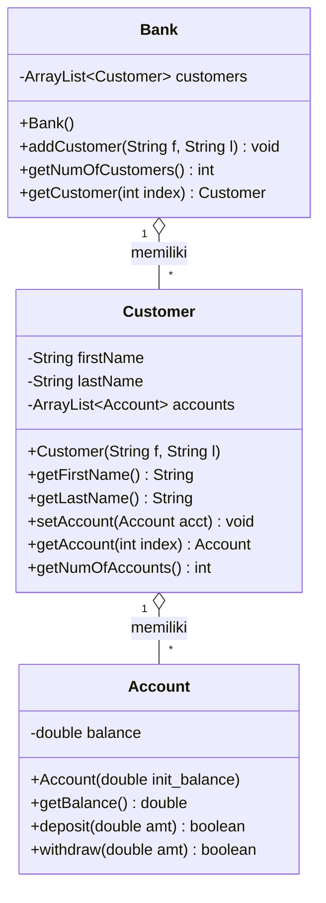

# 🏦 Simple Banking System (Java)


Aplikasi simulasi perbankan sederhana berbasis **Java** yang dibuat untuk mempelajari konsep **Object-Oriented Programming (OOP)** dan penggunaan **koleksi data dinamis (`ArrayList`)** untuk mengelola banyak objek.

---

## 📑 Daftar Isi

- [Tentang Proyek](#-tentang-proyek)
- [Fitur](#-fitur)
- [Konsep yang Dipelajari](#-konsep-yang-dipelajari)
- [Struktur Proyek](#-struktur-proyek)
- [Diagram Kelas](#-diagram-kelas)
- [Penjelasan Kelas](#-penjelasan-kelas)
- [Cara Menjalankan](#-cara-menjalankan)
- [Contoh Output](#-contoh-output)
- [Ide Pengembangan](#-ide-pengembangan)
- [Author](#-author)

---

## 📖 Tentang Proyek

Proyek ini memodelkan sistem perbankan dasar dengan hubungan antar objek sebagai berikut:

> **Satu `Bank`** memiliki **banyak `Customer`**, dan **satu `Customer`** dapat memiliki **banyak `Account`**.

Setiap relasi "banyak" dikelola menggunakan `ArrayList`, sehingga jumlah nasabah maupun rekening dapat bertambah secara dinamis tanpa batas ukuran tetap seperti array biasa.

## ✨ Fitur

- ✅ Menambahkan nasabah baru ke dalam bank
- ✅ Menambahkan satu atau lebih rekening untuk setiap nasabah
- ✅ Melihat saldo rekening
- ✅ Setor tunai (*deposit*) dengan validasi nominal
- ✅ Tarik tunai (*withdraw*) dengan validasi saldo
- ✅ Menampilkan jumlah total nasabah dan rekening

## 🧠 Konsep yang Dipelajari

| Konsep | Penerapan dalam Proyek |
|---|---|
| **Encapsulation** | Seluruh atribut bersifat `private` dan diakses melalui *getter* / method publik |
| **Constructor** | Inisialisasi objek `Account`, `Customer`, dan `Bank` |
| **Composition (Has-A)** | `Bank` → `Customer` → `Account` |
| **ArrayList** | Menyimpan daftar `Customer` dan `Account` secara dinamis |
| **Validasi Input** | Deposit hanya untuk nominal positif; withdraw hanya jika saldo mencukupi |
| **Return Boolean** | Method transaksi mengembalikan status berhasil / gagal |

## 📂 Struktur Proyek

```
📦 simple-banking-java
 ┣ 📜 Account.java       # Representasi rekening & transaksi
 ┣ 📜 Customer.java      # Representasi nasabah & daftar rekening
 ┣ 📜 Bank.java          # Pengelola daftar nasabah
 ┣ 📜 TestBanking.java   # Kelas utama (main) untuk pengujian
 ┗ 📜 README.md
```

## 🧩 Diagram Kelas



## 🔍 Penjelasan Kelas

### `Account`
Mewakili rekening bank dengan satu atribut `balance`.

| Method | Deskripsi |
|---|---|
| `getBalance()` | Mengembalikan saldo saat ini |
| `deposit(double amt)` | Menambah saldo jika `amt > 0`. Mengembalikan `true` jika berhasil |
| `withdraw(double amt)` | Mengurangi saldo jika `amt > 0` dan `amt <= balance`. Jika gagal, menampilkan pesan *"Transaksi Gagal: Saldo tidak mencukupi!"* dan mengembalikan `false` |

### `Customer`
Mewakili nasabah dengan nama depan, nama belakang, dan daftar rekening (`ArrayList<Account>`).

| Method | Deskripsi |
|---|---|
| `getFirstName()` / `getLastName()` | Mengambil nama nasabah |
| `setAccount(Account acct)` | Menambahkan rekening ke daftar milik nasabah |
| `getAccount(int index)` | Mengambil rekening berdasarkan indeks |
| `getNumOfAccounts()` | Mengembalikan jumlah rekening nasabah |

### `Bank`
Mengelola kumpulan nasabah dalam `ArrayList<Customer>`.

| Method | Deskripsi |
|---|---|
| `addCustomer(String f, String l)` | Membuat dan menambahkan nasabah baru |
| `getNumOfCustomers()` | Mengembalikan jumlah nasabah |
| `getCustomer(int index)` | Mengambil nasabah berdasarkan indeks |

### `TestBanking`
Kelas yang berisi method `main` untuk mensimulasikan alur transaksi: membuat nasabah, membuka rekening, deposit, withdraw (berhasil dan gagal), lalu menampilkan hasil akhir.

## 🚀 Cara Menjalankan

### Prasyarat
- **JDK 8** atau lebih baru ([Download JDK](https://adoptium.net/))

Cek instalasi dengan perintah:

```bash
java -version
javac -version
```

### Langkah-langkah

1. **Clone repositori**

   ```bash
   git clone https://github.com/<username>/<nama-repositori>.git
   cd <nama-repositori>
   ```

2. **Kompilasi seluruh file**

   ```bash
   javac *.java
   ```

3. **Jalankan program**

   ```bash
   java TestBanking
   ```

## 🖥️ Contoh Output

```text
Nasabah: Iqbal Mauluddin
Saldo Awal: Rp 100000
Setelah Deposit 50000: Rp 150000
Setelah Withdraw 30000: Rp 120000
Transaksi Gagal: Saldo tidak mencukupi!
Saldo Akhir: Rp 120000

Total Nasabah di Bank: 1
```

**Alur skenario pengujian:**

| Langkah | Aksi | Hasil | Saldo |
|:---:|---|---|---:|
| 1 | Buka rekening | Berhasil | Rp 100.000 |
| 2 | Deposit Rp 50.000 | Berhasil | Rp 150.000 |
| 3 | Withdraw Rp 30.000 | Berhasil | Rp 120.000 |
| 4 | Withdraw Rp 200.000 | ❌ Gagal (saldo kurang) | Rp 120.000 |

## 💡 Ide Pengembangan

- [ ] Menambahkan nomor rekening unik pada setiap `Account`
- [ ] Membuat jenis rekening turunan (`SavingsAccount`, `CheckingAccount`) dengan **inheritance**
- [ ] Menambahkan fitur transfer antar rekening
- [ ] Mencatat riwayat transaksi
- [ ] Menangani `IndexOutOfBoundsException` pada `getCustomer()` / `getAccount()`
- [ ] Menggunakan `BigDecimal` untuk presisi nilai uang
- [ ] Membuat menu interaktif dengan `Scanner`
- [ ] Menambahkan unit test menggunakan JUnit

## 👤 Author

**Iqbal Mauluddin**

- GitHub: [@username-kamu](https://github.com/username-kamu)

---

<p align="center">⭐ Jika proyek ini bermanfaat, jangan lupa beri bintang pada repositori ini! ⭐</p>
